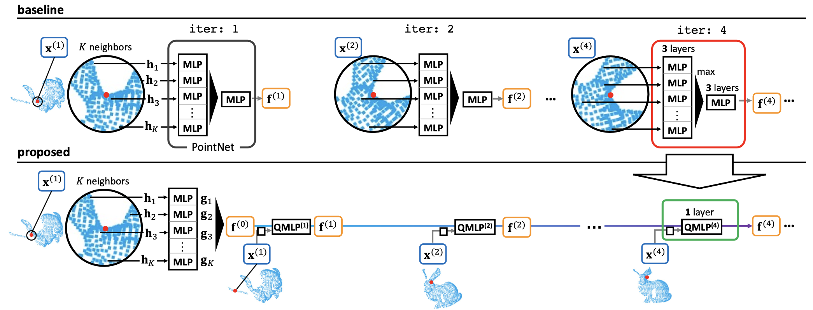

# Cascading Feature Extraction for Fast Point Cloud Registration
This repository contains the source code for the paper ["Cascading Feature Extraction for Fast Point Cloud Registration, (BMVC2021)"](https://arxiv.org/abs/2110.12204) by Yoichiro Hisadome and Yusuke Matsui.





|Method| rotation error (˚)| translation error (cm)| chamfer error| inferrence time (ms)|
|:-:|:-:|:-:|:-:|:-:|
| FGR| 31.4| 20| 0.012| 34|
| DCP-V2| 12.6| 17| 0.011| 12|
| RPMNet (Optim)| 1.71| 1.8| 0.00085| 58|
| RGM | 1.56| 1.5| 0.00084 | 174 |
| Proposed| 1.23| 1.3| 0.00076| 17|

## Getting Started
```
cascading_feature_extraction
|- datasets/
        |- modelnet40_ply_hdf5_2048.zip
        |- modelnet40_ply_hdf5_2048/
|- src/
    ...
|- pretrained/
        |- modelnet40.pth

```
### Download dataset

Please add ```--insecure``` at the end of the installation command, in order of lack of certificate

```
curl -O https://shapenet.cs.stanford.edu/media/modelnet40_ply_hdf5_2048.zip 
```

### Requirements
```
pip install -r requirements
```
We confirmed that the code runs at ```Python>=3.7```.


## Train
```
cd src
python train.py
```

## Test
```
cd src
python eval.py --resume ../pretrained/modelnet40.pth
```

## Citation
```
@inproceedings{hisadome2021,
  title = {Cascading Feature Extraction for Fast Point Cloud Registration},
  author = {Hisadome, Yoichiro and Matsui, Yusuke},
  booktitle = {Proceedings of the British Machine Vision Conference},
  year={2021}
}
```

## Acknowledgements
Our code is mainly based on [RPMNet](https://github.com/yewzijian/RPMNet). 
We appreciate them for making the code available.


